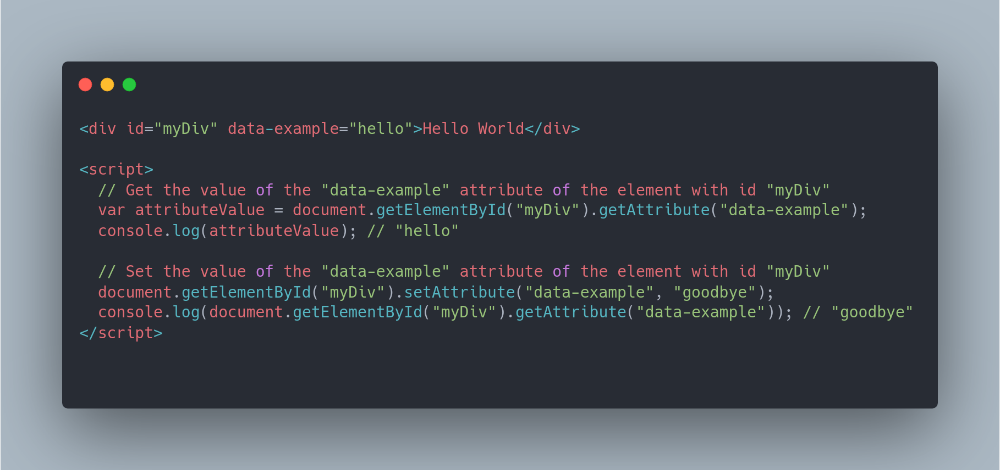
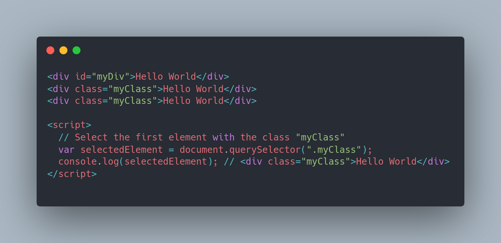
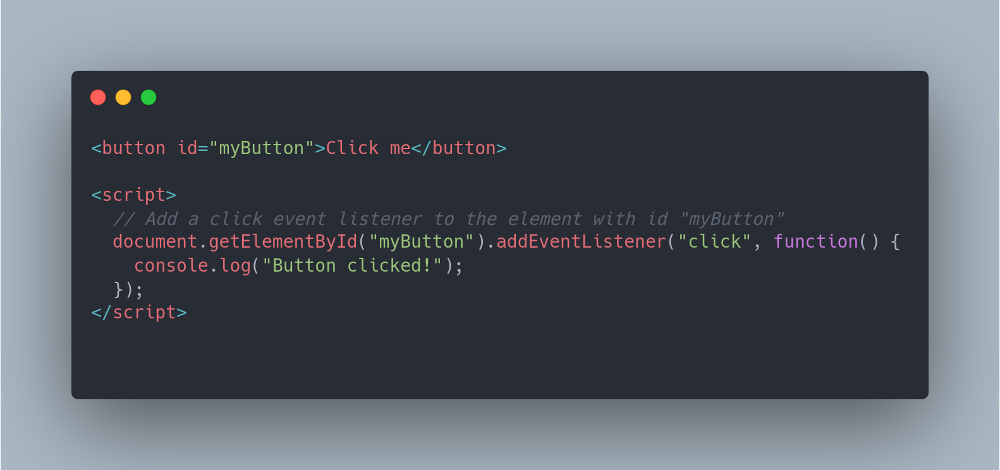

# Manipulacao do DOM

Existem vários métodos para manipular o Document Object Model (DOM) em JavaScript, incluindo:

document.getElementById(): permite acessar um elemento HTML pelo seu ID.

document.getElementsByTagName(): permite acessar uma coleção de elementos HTML com o mesmo nome de tag.

document.querySelector(): permite acessar o primeiro elemento HTML que corresponde a uma seleção CSS.

document.querySelectorAll(): permite acessar uma coleção de elementos HTML que correspondem a uma seleção CSS.

element.innerHTML: permite acessar o conteúdo HTML de um elemento específico.

element.style: permite acessar e modificar as propriedades de estilo de um elemento específico.

element.setAttribute(): permite definir ou modificar um atributo de um elemento específico.

element.appendChild(): permite adicionar um novo elemento como filho de um elemento específico.

Esses são apenas alguns exemplos de métodos de manipulação de DOM em JavaScript, há muitos outros métodos disponíveis também.

###### getAttribute/setAttribute:

###### QuerySelector:

###### addEventListener:

