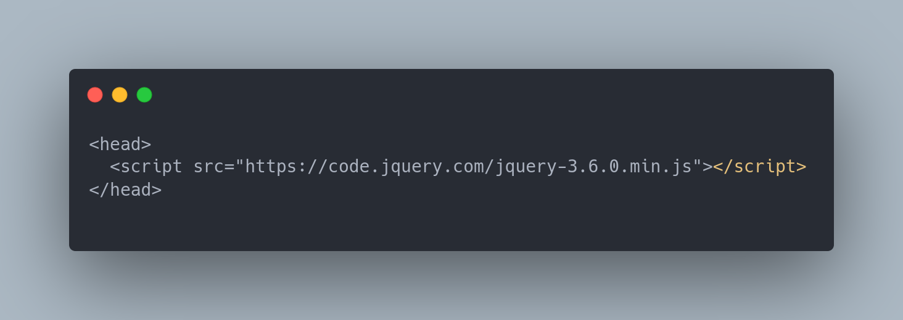
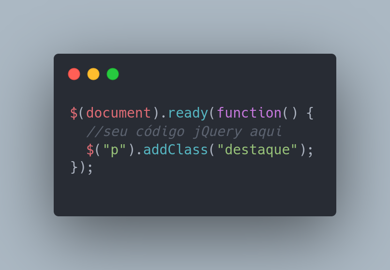

# O que e jQuery e como usa-lo:

jQuery é uma biblioteca JavaScript que facilita a manipulação do DOM (Document Object Model) e fornece recursos para criar animações, lidar com eventos e fazer chamadas AJAX. Aqui estão os passos básicos para começar a usar o jQuery em seu código:

### Baixe o jQuery ou use um CDN:
Você pode baixar o jQuery em seu site ou usar um CDN (Content Delivery Network) para ter acesso rápido e confiável ao arquivo. Por exemplo, você pode incluir o jQuery usando o seguinte código no cabeçalho do seu documento HTML:

### Inclua o código JavaScript:
Depois de incluir o arquivo jQuery em seu documento, você pode começar a usar o código jQuery em seu JavaScript. Você pode colocar seu código jQuery em um arquivo separado ou em uma tag script em seu documento HTML. Aqui está um exemplo de código jQuery que seleciona um elemento da página e adiciona uma classe a ele:

### Selecione elementos do DOM:

O jQuery usa seletores CSS para selecionar elementos do DOM, como $("p"), que seleciona todos os elementos 
 na página. Você pode usar seletores CSS para selecionar elementos com base em seu nome de tag, classe, ID, atributo e muito mais.

### Use métodos jQuery:

Depois de selecionar elementos com jQuery, você pode usar métodos jQuery para manipulá-los. Por exemplo, $("p").addClass("destaque") adiciona uma classe chamada "destaque" a todos os elementos 
 selecionados.

Esses são apenas alguns exemplos básicos de como usar o jQuery. Há muitas outras funcionalidades e recursos que você pode explorar, como animações, manipulação de formulários, requisições AJAX e muito mais. A documentação oficial do jQuery é um ótimo lugar para começar a explorar todas as possibilidades que a biblioteca oferece.
