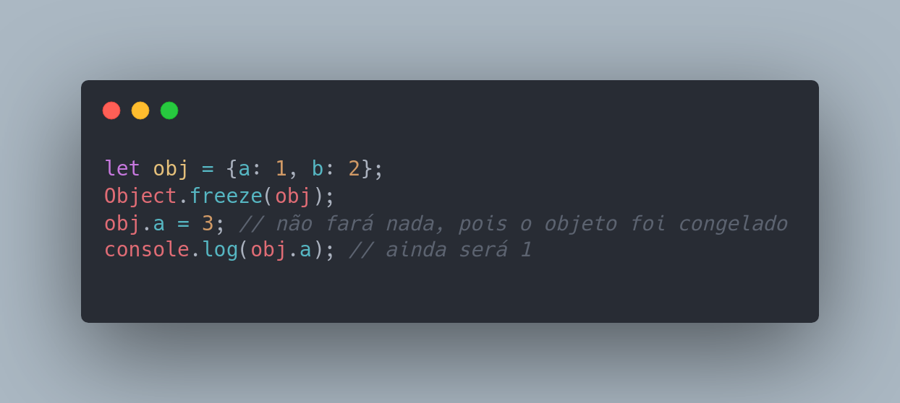
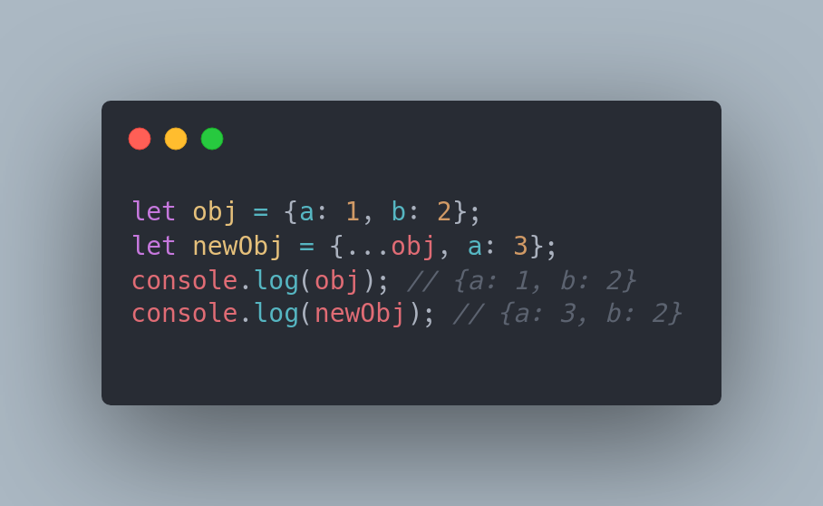
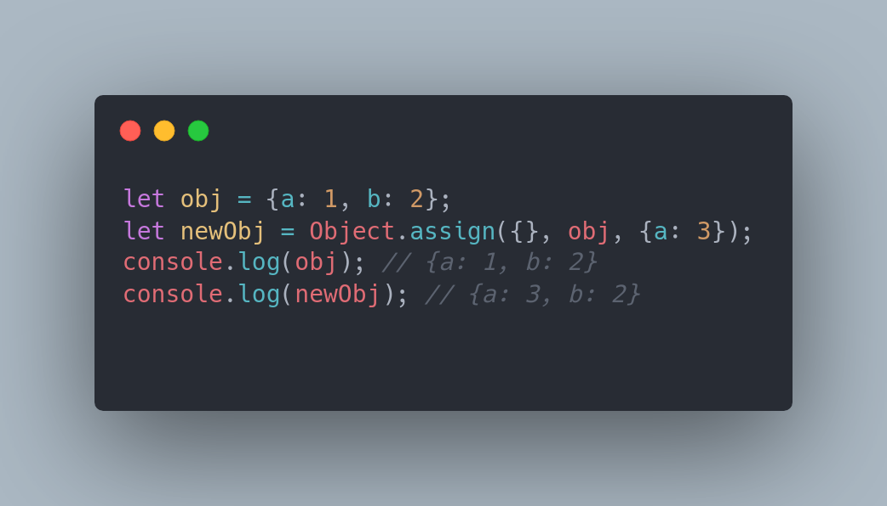

# O que e imutabilidade ?

Imutabilidade é um conceito de programação que se refere à incapacidade de modificar um objeto depois de criado. Isso significa que uma vez que um objeto é criado, suas propriedades ou valores não podem ser alterados. Isso é diferente da mutabilidade, onde os objetos podem ser modificados depois de serem criados. A imutabilidade é uma característica importante em muitas linguagens de programação, como Haskell, e pode ser usada para melhorar a segurança e a facilidade de uso do código.

#### Exemplo de imutabilidade em Javascript:

Em JavaScript, um exemplo de imutabilidade é usar o método Object.freeze() para congelar um objeto, o que impede que seus valores sejam modificados. Por exemplo:

Outra forma de se conseguir imutabilidade em JavaScript é utilizando o spread operator ... ou o método Object.assign() para criar uma cópia do objeto e modificar a cópia, ao invés de modificar o objeto original. Por exemplo:

ou

É importante notar que, apesar de existir essas formas de se conseguir imutabilidade em javascript, a linguagem não é nativamente imutável, então é preciso tomar cuidado ao trabalhar com objetos para não acabar modificando-os indevidamente.

