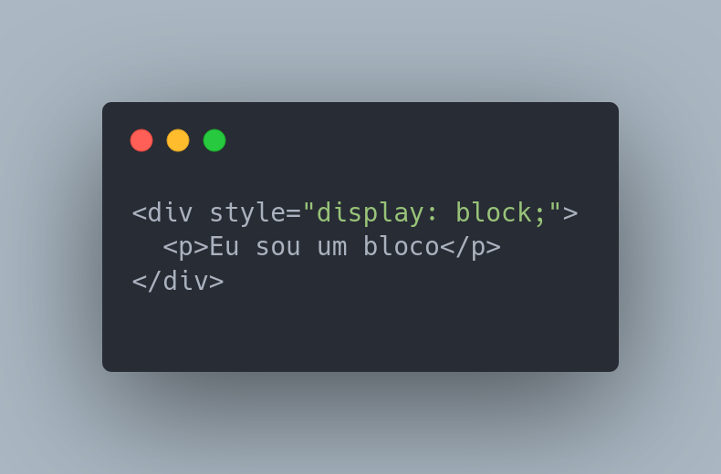
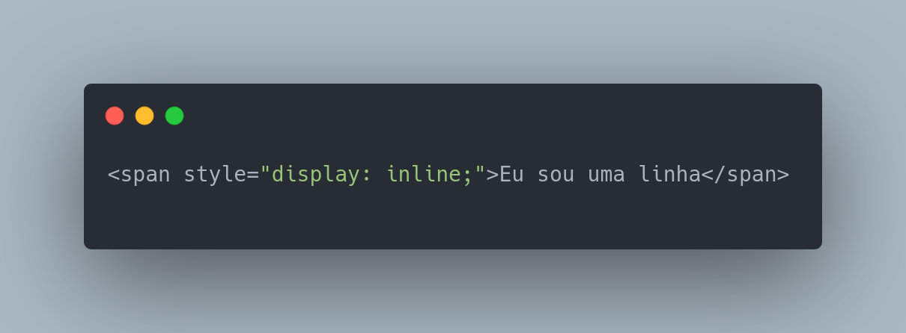
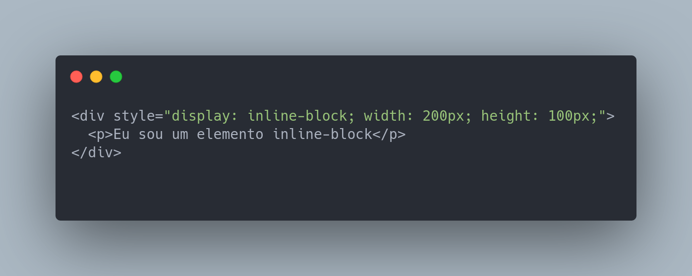
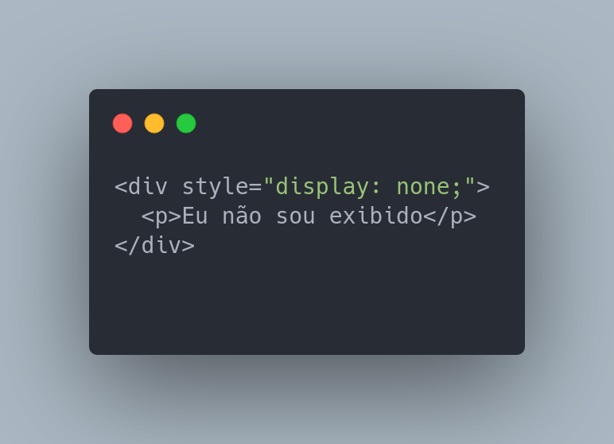

O posicionamento de elementos na página é uma das partes mais importantes e poderosas do CSS. Aqui está uma explicação detalhada sobre cada um dos itens mencionados:

    ### display:
    
    
    O display é uma propriedade que define como um elemento é exibido na página. Alguns dos valores comuns do display incluem:

   - block: O elemento é exibido como um bloco, ocupando todo o espaço disponível na largura do pai e começando em uma nova linha. 
   
    
   
   - inline: O elemento é exibido como uma linha, ocupando somente o espaço necessário para o conteúdo. 
   
    
    
   - display inline-block: O elemento gera uma caixa de elemento de bloco que fluirá com o conteúdo ao redor como se fosse uma única caixa em linha (comportando-se como um elemento substituído faria).
   
    
   
   - none: O elemento não é exibido na página. 
   
    
   
   
  
       
     
  
    
    

    
    
