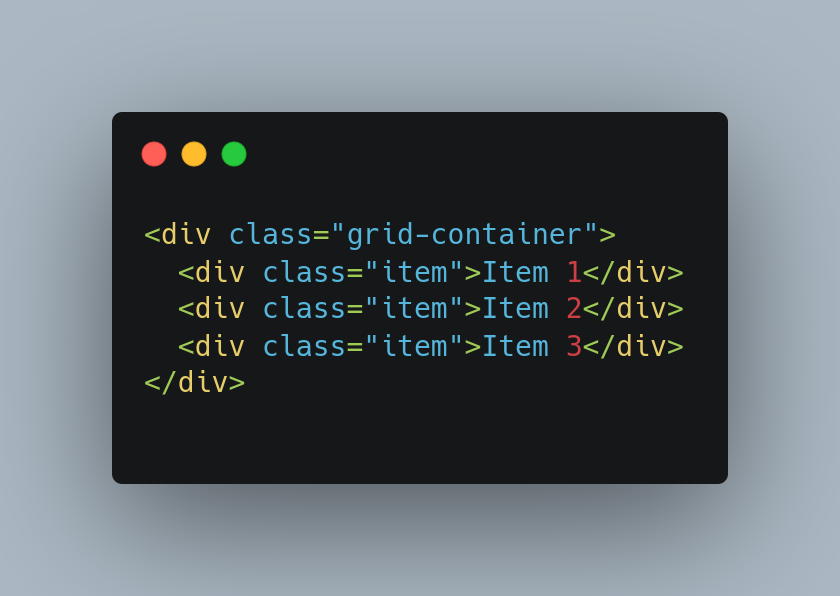
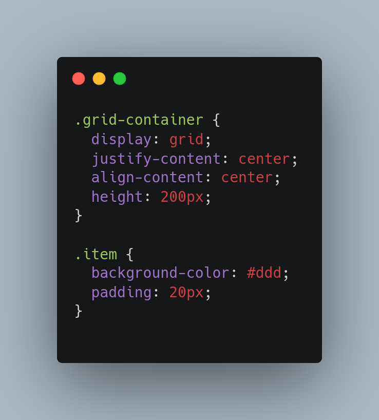

# css grid e suas propriedades:

CSS Grid é uma técnica de layout que permite criar layouts de página complexos com grade de linhas e colunas. Ele oferece controle preciso sobre a colocação e o tamanho dos elementos em uma página. Algumas das propriedades mais importantes do CSS Grid são:

display: grid: Define o elemento como um contêiner de grid.

grid-template-columns e grid-template-rows: Define o número e o tamanho das colunas e linhas da grade. Você pode especificar as larguras das colunas usando unidades como pixels ou porcentagens, ou usando palavras-chave como "fr" (fração) ou "auto" (tamanho automático).

grid-gap: Define o espaço entre as células da grade.

grid-template-areas: Permite definir áreas na grade e atribuir nomes a essas áreas para referenciá-las mais tarde em estilos CSS.

grid-row e grid-column: Essas propriedades permitem posicionar os itens na grade, definindo a linha e a coluna em que um item começa e termina.

grid-auto-rows e grid-auto-columns: Define o tamanho padrão das linhas e colunas criadas automaticamente.

grid-auto-flow: Define a direção de colocação automática de itens que não possuem posição definida.

Essas são algumas das propriedades mais importantes do CSS Grid, mas existem outras propriedades úteis para ajustar o layout e o estilo da grade. A utilização do CSS Grid é uma das formas mais eficientes e simples para criar layouts complexos em suas aplicações web.

# Como centralizar "div" com display grid ?

Para centralizar itens em um layout usando o display: grid, você pode usar as propriedades justify-content e align-content.

A propriedade justify-content centraliza os itens horizontalmente, enquanto a propriedade align-content centraliza os itens verticalmente. Para centralizar os itens tanto horizontalmente quanto verticalmente, você precisa usar ambas as propriedades.

Aqui está um exemplo de como centralizar os itens em um layout usando o display: grid:

Neste exemplo, definimos um contêiner de grade com display: grid e height: 200px. Em seguida, definimos as propriedades justify-content: center e align-content: center para centralizar os itens tanto horizontal quanto verticalmente. Por fim, adicionamos um estilo de fundo e preenchimento para os itens na grade.

Isso deve resultar em um layout onde os itens são centralizados no meio do contêiner de grade. Você pode ajustar as propriedades justify-content e align-content para centralizar os itens de outras maneiras, dependendo do que você precisa para o seu design.

