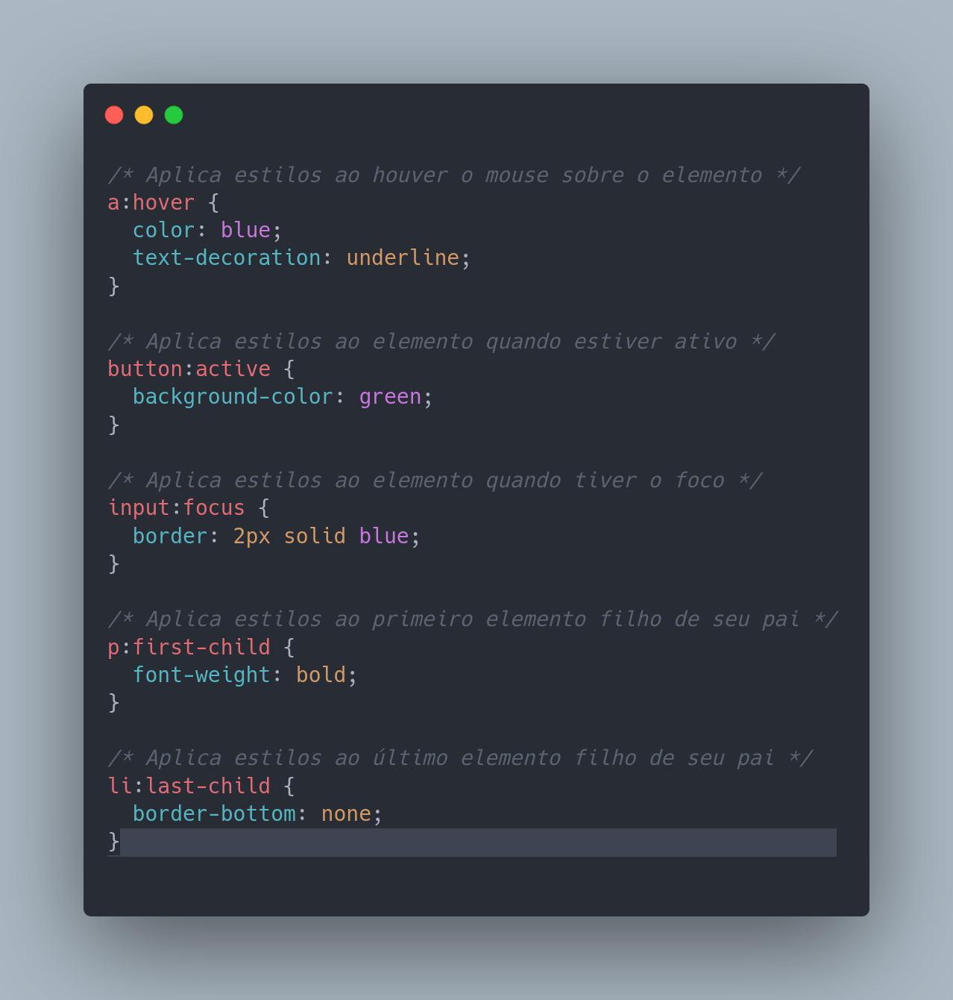
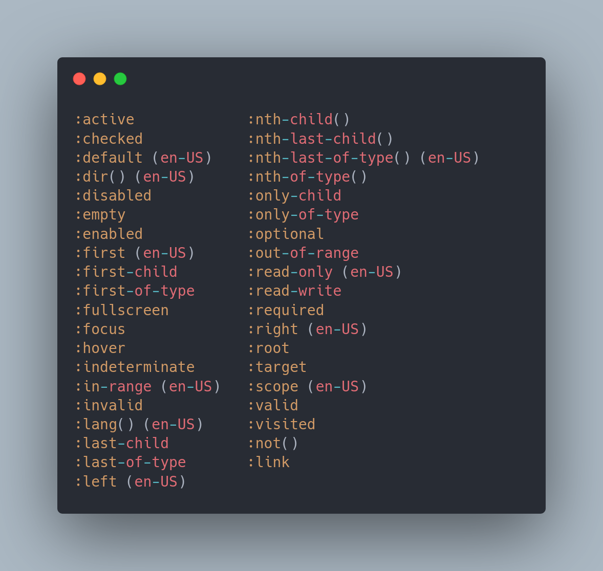

# O que sao pseudo-classes ?

CSS pseudo-classes são seletores especiais que permitem aplicar estilos a elementos HTML com base em seu estado ou posição, sem alterar o HTML. Alguns exemplos de pseudo-classes incluem:

    :hover - aplica estilos ao elemento quando o ponteiro do mouse estiver sobre ele
    :active - aplica estilos ao elemento quando estiver ativo, ou seja, quando estiver sendo clicado
    :focus - aplica estilos ao elemento quando tiver o foco, por exemplo, quando estiver selecionado para edição
    :first-child - seleciona o primeiro elemento filho de seu pai
    :last-child - seleciona o último elemento filho de seu pai

Pseudo-classes são adicionadas ao seletor de um elemento, separadas por um dois-pontos, como em p:hover {}.

####### Exemplo pratico:

####### todas as pseudo-classes:

