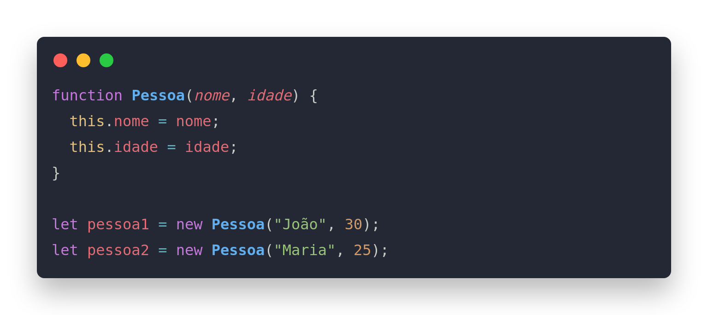
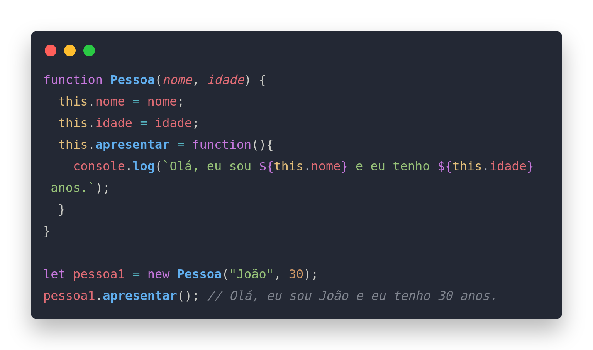

Em JavaScript, uma função construtora é um tipo especial de função que é usado para criar e inicializar um objeto. A função construtora é invocada usando a palavra-chave "new", que cria uma nova instância do objeto e define o valor de "this" para o novo objeto.

Aqui está um exemplo de uma função construtora:

Aqui está um exemplo de uma função construtora:

Copy code
function Pessoa(nome, idade) {
  this.nome = nome;
  this.idade = idade;
}

let pessoa1 = new Pessoa("João", 30);
let pessoa2 = new Pessoa("Maria", 25);
Neste exemplo, a função "Pessoa" é a função construtora, e ela cria duas novas instâncias do objeto Pessoa, "pessoa1" e "pessoa2", com as propriedades nome e idade especificadas. A função construtora também pode ter métodos definidos dentro dela, que podem ser usados ​​pelas instâncias criadas.

A função construtora é um conceito importante em JavaScript e é usado em muitas bibliotecas e frameworks populares, como React, Angular e Vue.
