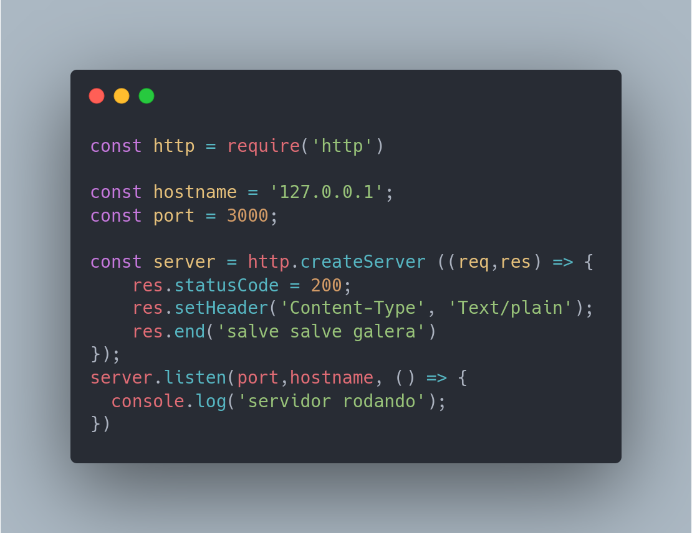

# Assincronismo em Ruby

Assincronismo em Ruby refere-se à capacidade de executar tarefas em paralelo, sem bloquear a execução de outras tarefas ou do programa principal. Isso é especialmente útil em situações em que você precisa lidar com operações que podem levar tempo para serem concluídas, como fazer chamadas de rede ou executar consultas de banco de dados.

Ruby oferece suporte a programação assíncrona por meio de várias bibliotecas, como o EventMachine, Async, Celluloid, Concurrent, Fiber e Thread. Cada uma dessas bibliotecas implementa suas próprias abstrações para lidar com a programação assíncrona.

O EventMachine, por exemplo, usa a abstração de eventos para lidar com a programação assíncrona, enquanto o Async usa a abstração de tarefas. Já o Fiber e o Thread oferecem um modelo de concorrência baseado em threads, permitindo que você execute várias tarefas em paralelo.

Aqui está um exemplo simples de como usar o Async para executar duas tarefas assíncronas ao mesmo tempo:

Este código cria duas tarefas assíncronas que imprimem mensagens na tela e as executa em paralelo usando a biblioteca Async. O Async permite que você crie tarefas aninhadas, o que significa que você pode criar tarefas dentro de outras tarefas para criar fluxos de controle mais complexos.

A programação assíncrona em Ruby pode ser um pouco mais complicada do que a programação síncrona, mas é uma técnica poderosa que pode ajudar a melhorar o desempenho e a escalabilidade de seus programas.

