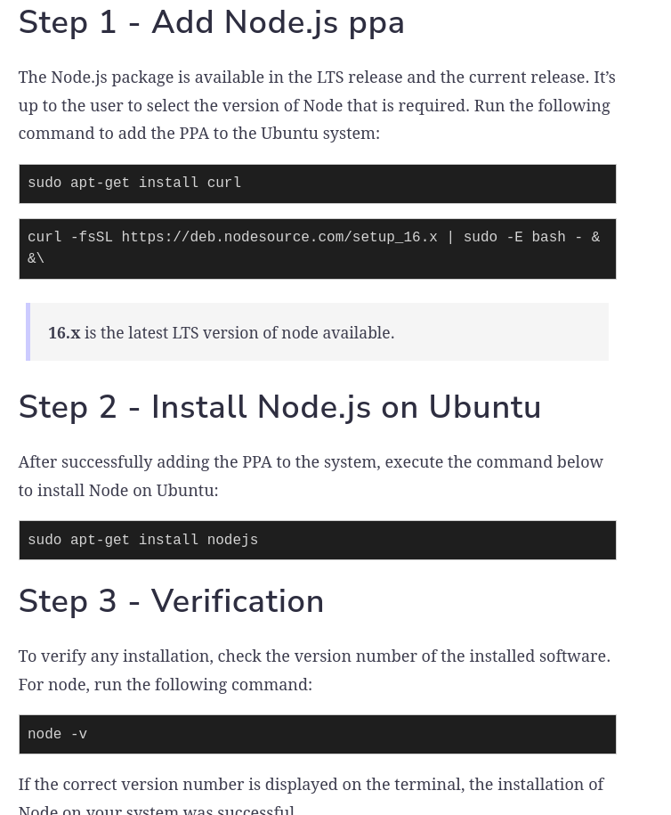
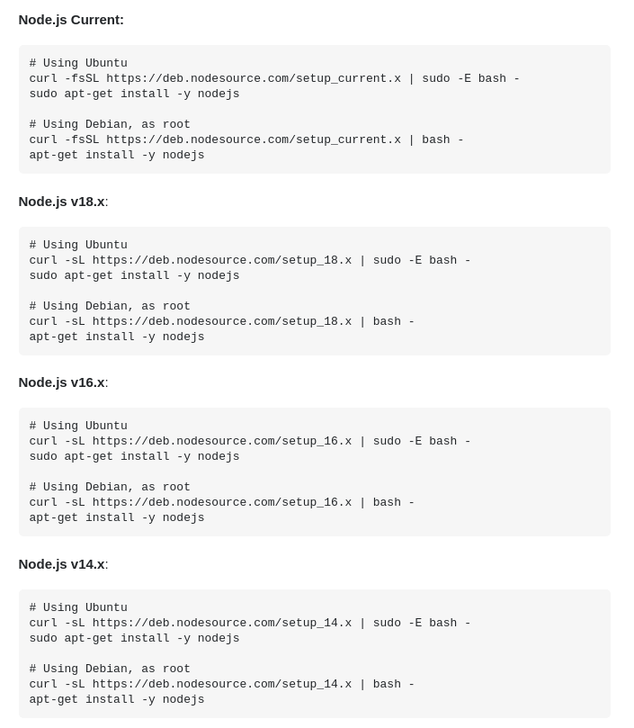
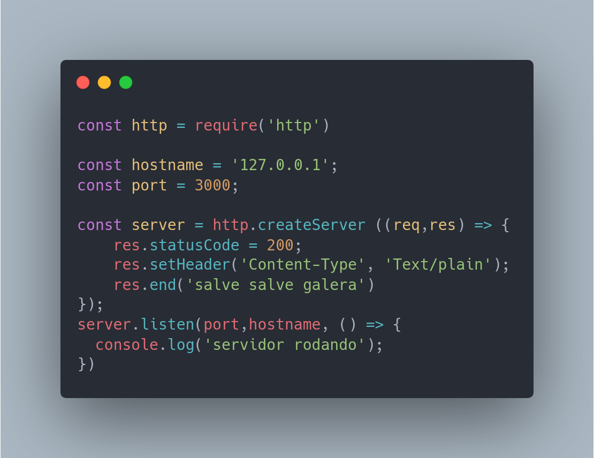
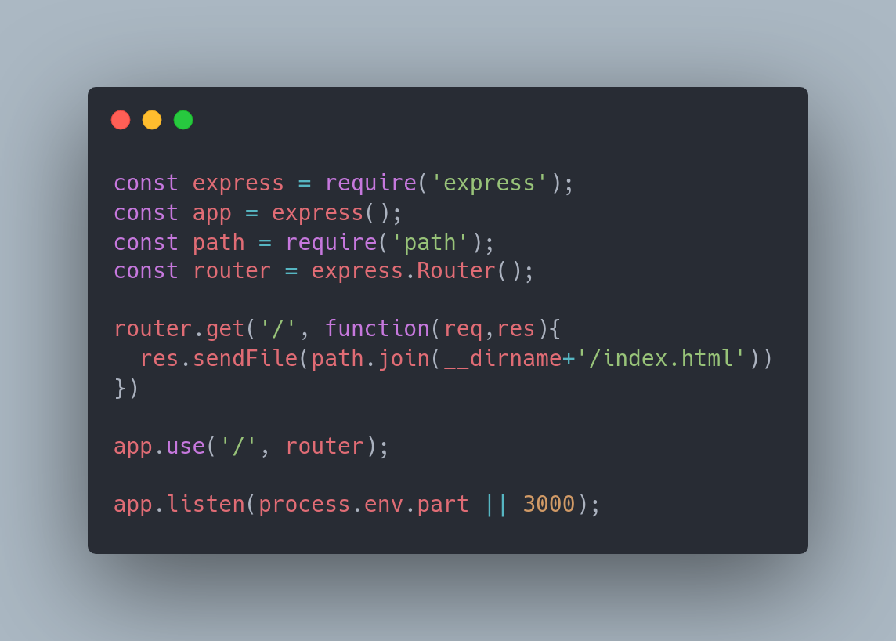

# instalando e fazendo update no NODEjs para ubunto

###### Instalei o node seguindo os codigos abaixo:

Logo me deparei fazendo o comando node -v que a versao instalada estava desatualizada v16.19.0, logo procurei algumas linhas de codigo que resolvessem o problema rapidamente, e assim depois de falhar 2 vezes encontrei isto:

Usei o current demonstrado na primeira linha "Ubunto", e pronto ! 

###### Version v18.13.0 sucessfully instaled

##### Alguns testes que fiz com nodeJS:

##### Utilizando express para criar uma rota:

