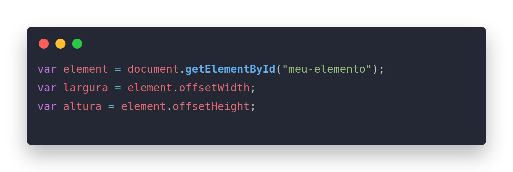
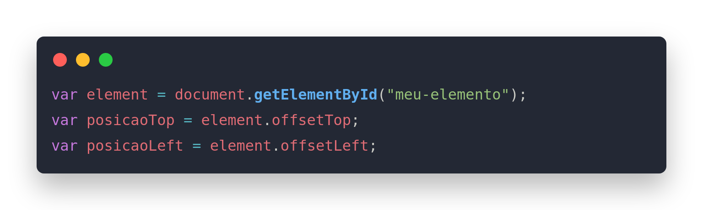
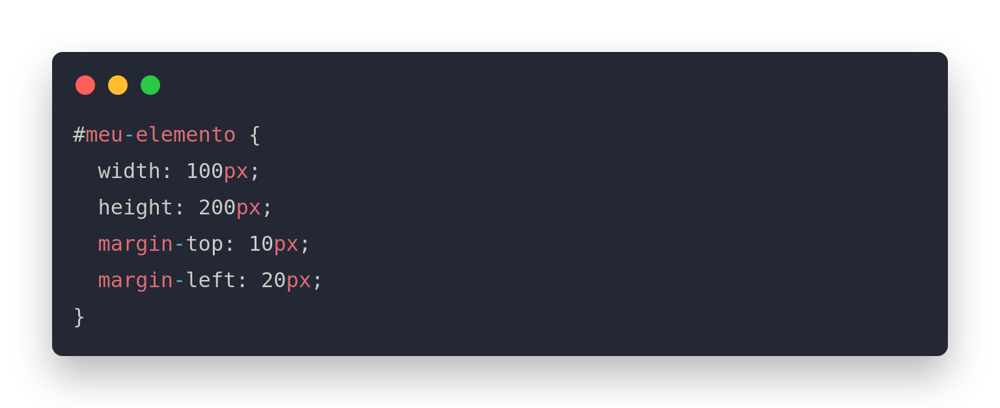

#Dimensoes e Distancias

As dimensões e distâncias em JavaScript podem ser manipuladas com o uso de bibliotecas, como o jQuery ou o CSS.

Para obter a largura e altura de um elemento HTML, você pode usar as propriedades offsetWidth e offsetHeight. Por exemplo:

Para obter a posição de um elemento em relação ao topo da página, você pode usar as propriedades offsetTop e offsetLeft. Por exemplo:

Além disso, o CSS também pode ser usado para definir dimensões e distâncias em um elemento HTML. Por exemplo:

Você também pode usar as funções getComputedStyle ou getBoundingClientRect para obter informações sobre a posição e dimensões de um elemento.
