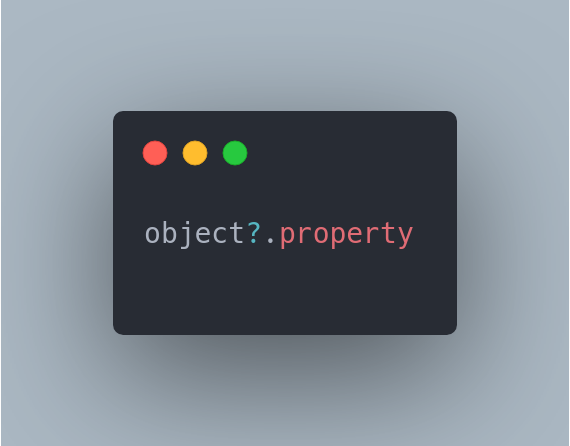
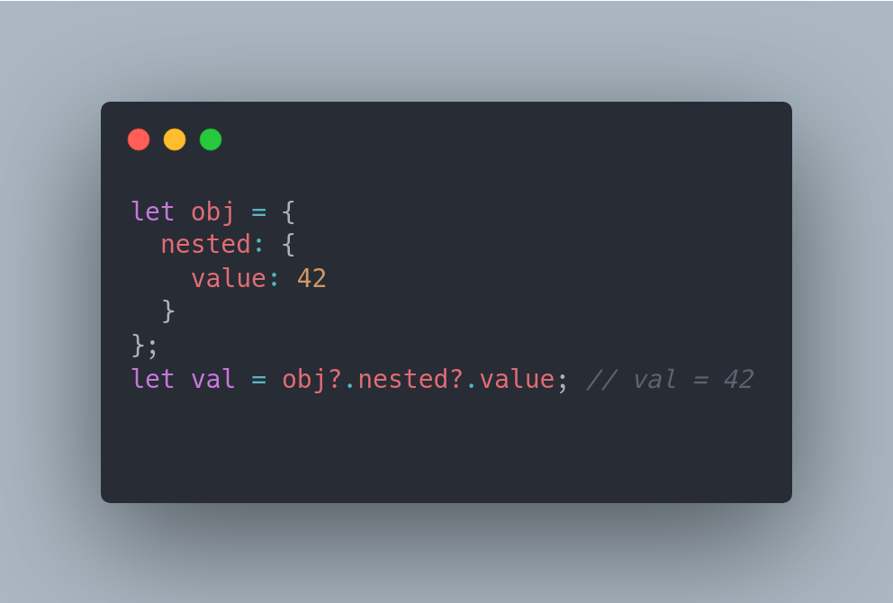
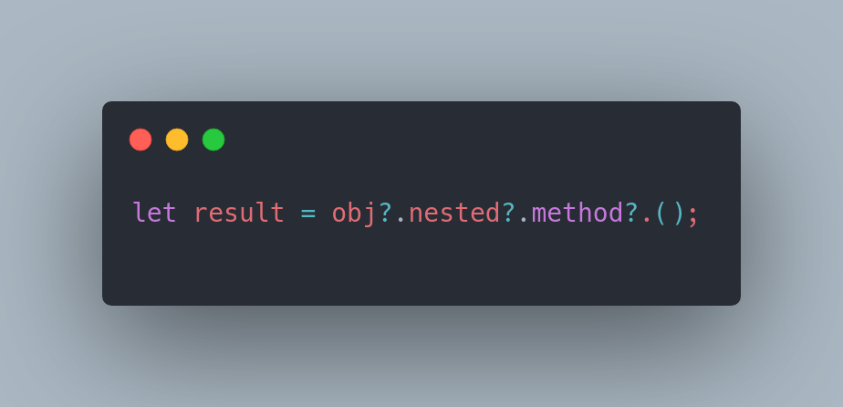
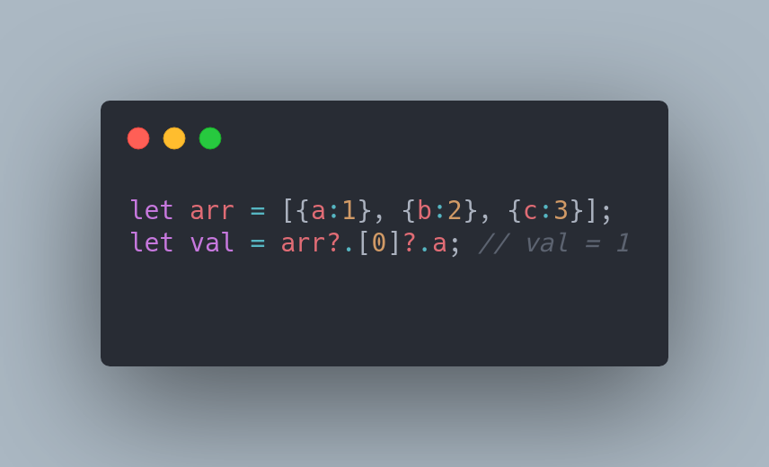

# Opitional Chaining

O "Optional Chaining" é um recurso adicionado no ECMAScript 2020 e é usado para acessar propriedades ou métodos de objetos aninhados sem ter que se preocupar com a verificação de null ou undefined. Ele permite acessar uma propriedade ou método de um objeto aninhado sem receber um erro "Cannot read property '...' of undefined" quando algum dos objetos aninhados é undefined.

Sintaxe:

Exemplo:

No exemplo acima, o operador ?. permite acessar a propriedade "value" dentro do objeto aninhado "nested" sem gerar um erro, mesmo que o objeto "obj" ou o objeto aninhado "nested" sejam undefined.

Também é possível usar o "Optional Chaining" com métodos:

Além disso, é possível usar o "Optional Chaining" com arrays, para acessar elementos aninhados:

O "Optional Chaining" é uma forma mais clara e concisa de escrever códigos para tratar valores nulos ou indefinidos, e é uma boa prática de programação para evitar erros de referência undefined ou null.
