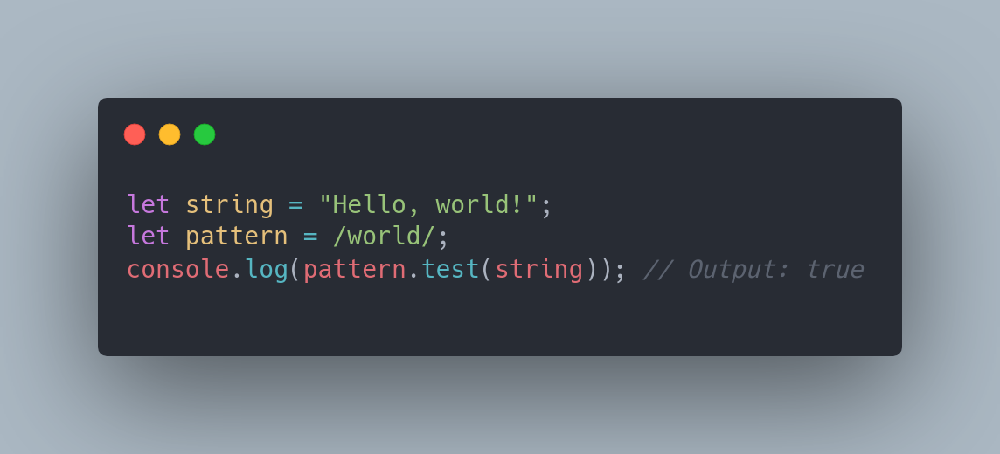
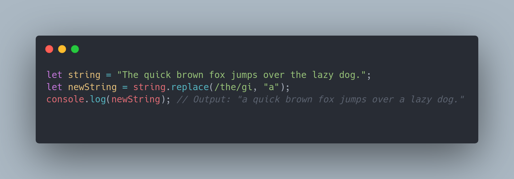
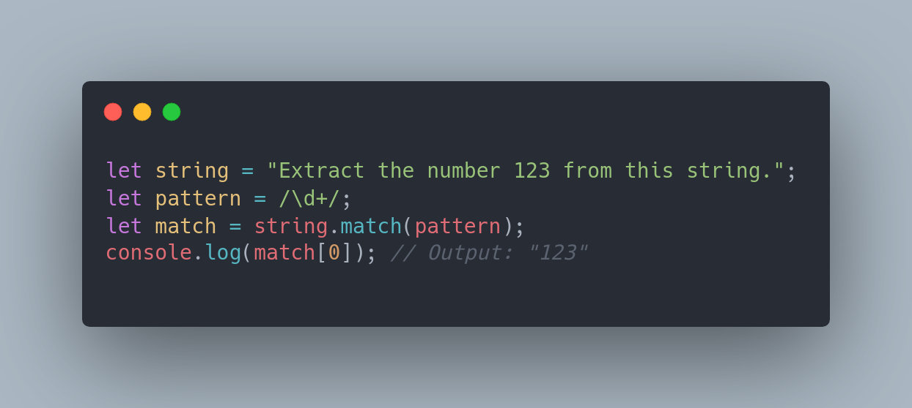
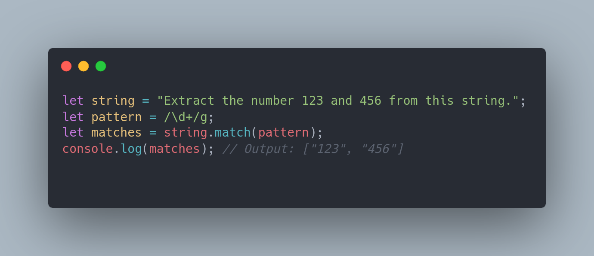

# REGEX (Regular Expression)

###### Oque e:

Regex é a abreviação de "expressão regular". Elas são uma forma de descrever uma série de possíveis combinações de caracteres em uma string. As expressões regulares são usadas para verificar se uma string corresponde a um determinado padrão, para encontrar e substituir substrings em uma string, e para extrair informações de uma string. Elas são amplamente utilizadas em diversas áreas, incluindo programação, processamento de texto, busca e extração de dados.

###### Exemplos de REGEX em JS:

######### Verificar se uma string corresponde a um padrão:

######### Encontrar e substituir substrings:

######### Extrair informações de uma string:

######### Extrair varios matches de uma string

Esses são apenas alguns exemplos básicos de como usar expressões regulares em JavaScript. As expressões regulares são ferramentas poderosas e podem ser usadas de muitas outras maneiras.

