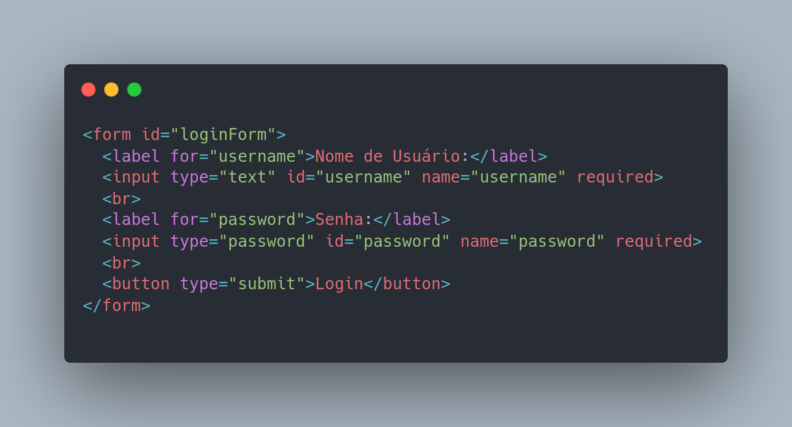
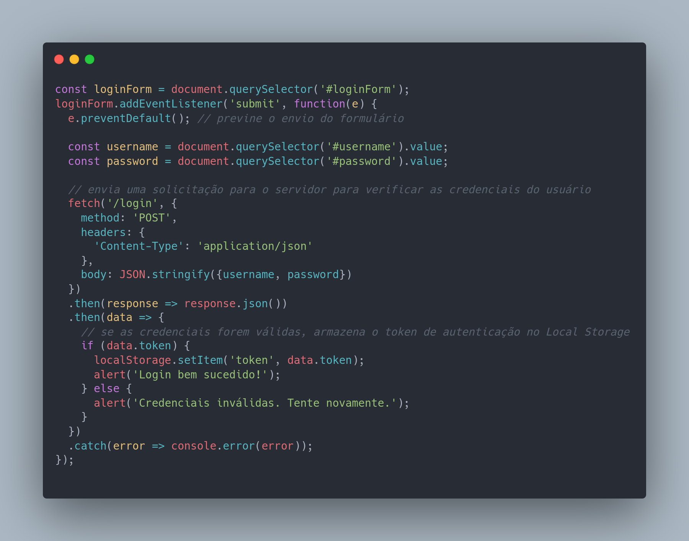

# O que e LocalStorage e Coockies ?

Local Storage e Cookies são duas formas de armazenamento de dados no lado do cliente em um navegador da web.

Cookies são pequenos arquivos de texto que são armazenados no computador do usuário pelo navegador da web. Eles geralmente são usados para armazenar informações como preferências do usuário, informações de login e histórico de navegação. Os cookies podem ser acessados pelo servidor que os criou ou por outros servidores que compartilham o mesmo domínio.

Já o Local Storage é uma forma de armazenamento persistente de dados no navegador da web. Ele permite armazenar dados em pares de chave-valor, semelhante aos cookies, mas com algumas diferenças importantes. Os dados armazenados no Local Storage não são enviados para o servidor com cada solicitação HTTP, tornando-o uma opção mais rápida e eficiente para armazenar dados no navegador.

Uma outra diferença entre os dois é que o Local Storage permite armazenar uma quantidade maior de dados, enquanto os cookies têm um limite máximo de tamanho e quantidade de arquivos que podem ser armazenados no navegador. Além disso, o Local Storage não tem um tempo de expiração, enquanto os cookies podem ter um tempo de vida útil definido.

Em resumo, cookies e Local Storage são formas diferentes de armazenar dados no navegador da web. Os cookies são mais antigos e possuem algumas limitações, enquanto o Local Storage é uma opção mais moderna e eficiente para armazenar dados no navegador. Cabe ao desenvolvedor escolher qual opção é mais adequada para cada caso específico.

### Um exemplo de uso pratico do LocalStorage e a autenticação de login

A autenticação com Local Storage é uma forma de autenticação no lado do cliente em um navegador da web, onde as informações de autenticação são armazenadas no Local Storage do navegador.

Para implementar a autenticação com Local Storage, o desenvolvedor pode criar um formulário de login onde o usuário insere suas credenciais de login (por exemplo, nome de usuário e senha). Quando o usuário envia o formulário, o servidor verifica as credenciais e, se forem válidas, envia uma resposta com um token de autenticação.

O token de autenticação é então armazenado no Local Storage do navegador do usuário. Isso permite que o usuário seja autenticado em solicitações futuras para o mesmo servidor, sem precisar inserir suas credenciais novamente.

Para proteger a segurança do token de autenticação armazenado no Local Storage, é importante usar técnicas como criptografia ou assinaturas digitais para proteger o token. O desenvolvedor também deve se certificar de que o servidor verifica o token de autenticação em cada solicitação para garantir que apenas usuários autenticados tenham acesso aos recursos protegidos.

No entanto, deve-se lembrar que a autenticação no lado do cliente tem limitações e não é suficiente para proteger completamente um aplicativo web contra ataques maliciosos. O servidor deve sempre validar as solicitações de usuários autenticados para garantir que as solicitações são legítimas e autorizadas.

Aqui está um exemplo de código simples em JavaScript que ilustra como implementar autenticação com Local Storage em um formulário de login:

### HTML:

### JavaScript:

Este exemplo simplesmente envia uma solicitação para um servidor quando o usuário envia o formulário de login. O servidor deve então verificar as credenciais do usuário e retornar um token de autenticação se as credenciais forem válidas. Se o token for retornado, ele é armazenado no Local Storage do navegador e o usuário é considerado autenticado.

O token armazenado no Local Storage pode ser usado para autenticar o usuário em solicitações futuras, enviando-o no cabeçalho da solicitação para o servidor. O servidor pode então verificar o token e permitir ou negar o acesso aos recursos protegidos com base na validade do token.

