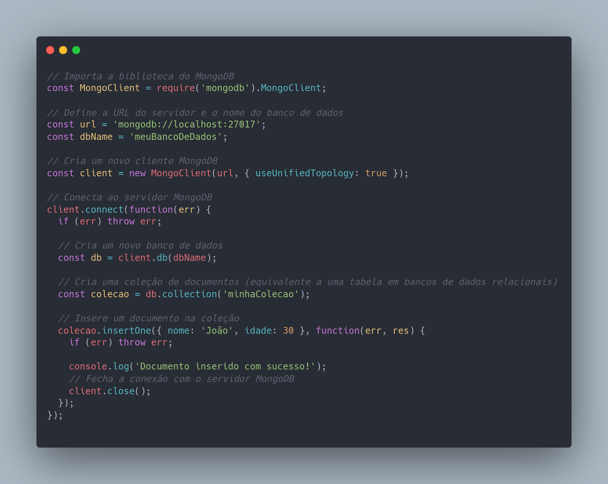

# Tipos de banco de dados

Os tipos de bancos de dados mais utilizados para aplicações web, como e-commerce, são os bancos de dados relacionais, como MySQL, PostgreSQL e Oracle, e os bancos de dados NoSQL, como MongoDB e Cassandra. Os bancos de dados relacionais são utilizados para dados altamente estruturados, enquanto os bancos de dados NoSQL são usados para dados não estruturados e escalabilidade horizontal.

Exemplo de banco de dados feito em MongoDB:

