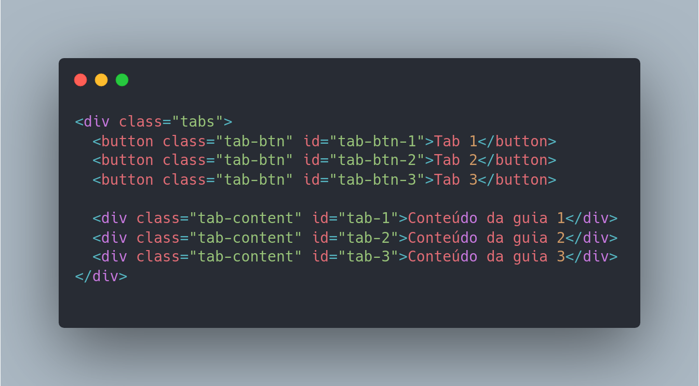

# Manipulacao do DOM - Navegacao por tabs

A navegação por guias (ou "tabs") em JavaScript geralmente é feita usando eventos do JavaScript para alternar entre conteúdos diferentes dentro de uma página HTML, geralmente usando elementos HTML como botões e divs. Isso é feito através de manipulação do DOM para mostrar ou ocultar elementos específicos.

Por exemplo, você pode ter vários elementos div com conteúdo diferente e um conjunto de botões que atuam como guias. Ao clicar em um botão, você pode usar JavaScript para esconder todos os divs e mostrar apenas o div correspondente ao botão clicado.

Existem também bibliotecas de terceiros e frameworks JavaScript como Bootstrap e jQuery UI que fornecem recursos de guia prontos para usar.

###### JavaScript exemplo:

Este exemplo usa uma estrutura HTML básica com botões de guia e conteúdos de guia embutidos. Ele usa a função querySelectorAll para selecionar todos os botões e conteúdos de guia, e, em seguida, adiciona um manipulador de evento de clique a cada botão. Quando um botão é clicado, ele remove a classe "ativa" de todos os botões e adiciona essa classe ao botão clicado, e esconde todos os conteúdos de guia e mostra apenas o conteúdo de guia correspondente ao botão clicado.
